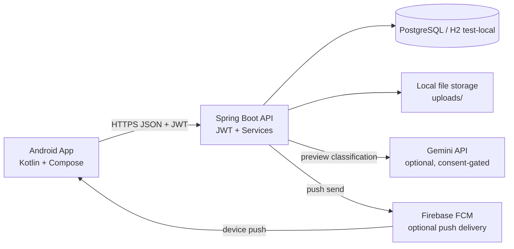

# EcoBook AI - Architecture

**Status**: runtime-aligned technical overview  
**Date**: 2026-05-23

---

## Component View

---

## Backend Layers

The backend follows the current runtime flow:

- `controller -> service -> repository`
- controllers validate request shape, parse enums and build the HTTP envelope
- services own state transitions, normalization rules, security-sensitive checks and side effects
- repositories encapsulate persistence and locking patterns

Key runtime modules:

- `AuthController` / `AuthService`: register, login, password hashing, JWT issuance
- `UsuarioController` / `UsuarioService`: profile completion, consent changes, account deletion and self-service profile edits
- `MaterialController` / `MaterialService`: preview, upload promotion, publication, edit and delete
- `SolicitacaoController` / `SolicitacaoService`: request lifecycle and reservation expiry
- `AdminController`, `ReportController`, `NotificationController`: moderation, inbox and admin surfaces

---

## Main Consistency Rules

### Profile gate

- protected flows require `perfil_completo`
- city is normalized to uppercase ASCII for matching
- neighborhood stays human-readable after trimming
- changing the email changes the login identity and invalidates the previous JWT session

### Material lifecycle

- preview stores a temporary upload first
- publication promotes the file to permanent storage only once
- if promotion succeeds but persistence fails, the promoted file is cleaned up

### Request lifecycle

- `DISPONIVEL -> RESERVADO -> DOADO`
- one approved request per material
- approving one request auto-rejects competing pendings
- expiry reopens reserved materials
- deleting an approved student account also reopens the reserved material

### Consent and AI

- platform consent is visible in app UX before acceptance
- AI consent is optional and can be revoked later
- without AI consent, preview falls back to manual completion instead of blocking publication forever

---

## State Machines

### Material

- `DISPONIVEL`: searchable and requestable
- `RESERVADO`: has an approved request and rejects new requests
- `DOADO`: completed donation
- `CANCELADO`: removed from active circulation

### Solicitacao

- `PENDENTE`: waiting donor action
- `APROVADA`: donor contact released, reservation countdown active
- `RECUSADA`: donor rejected
- `CANCELADA`: student canceled or system/admin cleanup happened
- `CONCLUIDA`: donation finished

---

## Operational Notes

- local quickstart path: Spring profile `local`
- automated tests: `Testcontainers -> external PostgreSQL -> H2`
- observability baseline: Micrometer + `/actuator/prometheus`
- immutable reference data is cached server-side and mirrored with Android fallback
